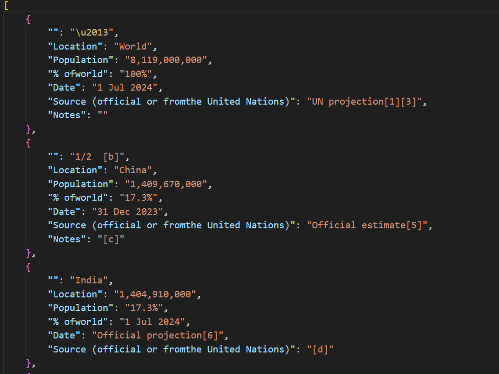

# Scraping Wikipedia with Beautiful Soup  

This project demonstrates how to scrape Wikipedia pages using **Beautiful Soup**.  
The example focuses on extracting the list of countries and dependencies by population.  


## Example Output  



The data extracted includes  the **country names**, **population**,**date**, and other related information from the following [Wikipedia page](https://en.wikipedia.org/wiki/List_of_countries_and_dependencies_by_population).  

## Technologies Used  

| Technology      | Description                          |
|------------------|--------------------------------------|
| **Python**       | Programming language for scripting. |
| **Beautiful Soup** | Library for web scraping.          |
| **Requests**     | HTTP library for fetching data.     |

## How to Run  
1. Clone the repository:  
   ```bash
   git clone https://github.com/amirreza4521/wikipedia-scraping-BS4.git
   cd wikipedia-scraping-BS4

2. Install required dependencies:
    ```bash
    pip install requests
    pip install beautifulsoup4
